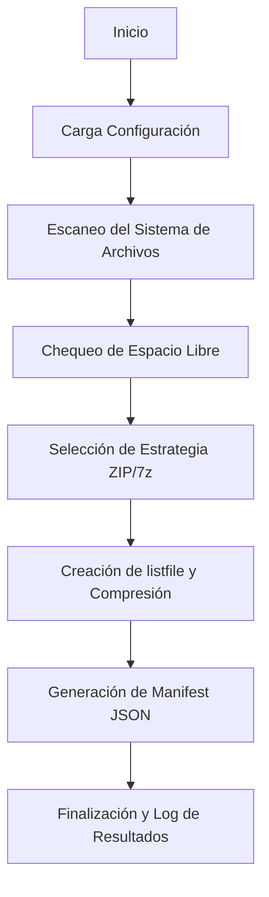

```markdown
# 🧠 Copia de Seguridad Eficiente (ZIP preferente con 7-Zip; fallback Python ZIP)

## 📘 Descripción general

Script Python avanzado para realizar **copias de seguridad comprimidas y seguras** utilizando una arquitectura robusta basada en patrones de diseño:

> **Facade + Strategy + Observer + Singleton + Pipeline (streaming O(1) RAM)**

El objetivo es combinar **rendimiento, compatibilidad y estabilidad**, con soporte para:
- **7-Zip CLI (preferente)**: ZIP Deflate multihilo o 7z (LZMA2).  
- **Fallback nativo Python (zipfile)**: Sin dependencias externas, modo streaming, uso O(1) de RAM.

Ideal para entornos **Windows**, donde se requiere respaldo rápido y automatizado de carpetas críticas con metadatos y control de espacio disponible.

---

## ⚙️ Características principales

✅ **Compresión híbrida automática**
- **Vía A (recomendada):** 7-Zip CLI  
  - ZIP multihilo (Deflate)
  - 7z LZMA2 (alta compresión)
- **Vía B (fallback):** `zipfile` nativo Python (Deflate, sin dependencias)

✅ **Arquitectura profesional**
- **Facade** → Simplifica la ejecución  
- **Strategy** → Selección dinámica del método de compresión  
- **Observer** → Seguimiento de progreso  
- **Singleton ConfigManager** → Config global centralizada  
- **Pipeline** → Procesamiento en streaming con uso constante de memoria  

✅ **Funcionalidades extra**
- Exclusión de subdirectorios específicos  
- Progreso en consola con observadores  
- Manifest JSON con metadatos detallados  
- Chequeo automático de espacio libre antes de iniciar  
- Nombres de archivo compatibles con Windows (`YYYY-MM-DDTHH-MM-SS`)  
- Soporte para rutas largas y caracteres Unicode  

---

## 🧩 Requisitos

### 🐍 Python
- **Python ≥ 3.8**
- Librerías estándar: `os`, `subprocess`, `shutil`, `zipfile`, `json`, `logging`, `math`, `pathlib`, etc.  
  *(No requiere instalación adicional.)*

### 🗜️ Opcional: 7-Zip CLI
Para aprovechar la **compresión multihilo de alto rendimiento**, se recomienda instalar [7-Zip](https://www.7-zip.org/download.html) y asegurar que `7z.exe` esté disponible en una de las siguientes rutas:

```

C:\Program Files\7-Zip\7z.exe
C:\Program Files (x86)\7-Zip\7z.exe

````

O bien, añadirlo al **PATH** del sistema.

---

## 🚀 Ejecución

### 1️⃣ Configura tus rutas en `main()`

Edita la sección principal del script:

```python
SOURCES = [
    r"C:\Users\PC\Documents",
    r"C:\Users\PC\Pictures"
]
EXCLUDE_DIRS = [
    r"C:\Users\PC\Documents\example"
]
OUTPUT_DIR = r"C:\Users\PC\Downloads"

PREFERRED_FORMAT = "zip"    # "zip" o "7z"
ZIP_LEVEL = 6               # (0–9) Compresión Deflate
SEVEN_Z_LEVEL = 7           # (0–9) Compresión LZMA2
````

### 2️⃣ Ejecuta el script

En consola (PowerShell o CMD):

```bash
python 01_SSD_to_zip.py
```

### 3️⃣ Resultado esperado

* Archivo comprimido generado:

  ```
  Copia_Seguridad_2025-10-22T14-35-59.zip
  ```
* Archivo manifest JSON:

  ```
  Copia_Seguridad_2025-10-22T14-35-59.zip.manifest.json
  ```

Ejemplo de manifest:

```json
{
  "output": "C:\\Users\\PC\\Downloads\\Copia_Seguridad_2025-10-22T14-35-59.zip",
  "created_at": "2025-10-22T14:35:59",
  "preferred_format": "zip",
  "used_format": "zip",
  "sources": ["C:\\Users\\PC\\Documents", "C:\\Users\\PC\\Pictures"],
  "excluded": ["C:\\Users\\PC\\Documents\\example"],
  "totals": {"files": 1524, "bytes": 134217728},
  "zip": {"level": 6},
  "7z": {"level": 7},
  "threads_hint": 15,
  "status": "ok",
  "elapsed_seconds": 32.5,
  "output_size_bytes": 67829345
}
```

---

## 🧱 Estructura interna

| Componente                     | Rol                                                | Patrón        |
| ------------------------------ | -------------------------------------------------- | ------------- |
| `ConfigManager`                | Configuración global (singleton)                   | **Singleton** |
| `FileSystemWalker`             | Exploración eficiente de ficheros                  | **Pipeline**  |
| `ConsoleProgressObserver`      | Registro del progreso en tiempo real               | **Observer**  |
| `IArchiveStrategy` + subclases | Implementaciones ZIP/7z/zipfile                    | **Strategy**  |
| `BackupFacade`                 | Punto de entrada simplificado para todo el proceso | **Facade**    |

---

## 📊 Flujo general del proceso



---

## 🧩 Estrategias disponibles

| Estrategia               | Compresión    | Dependencia   | Multihilo | Notas                     |
| ------------------------ | ------------- | ------------- | --------- | ------------------------- |
| `SevenZipCliZipStrategy` | ZIP (Deflate) | 7z.exe        | ✅ Sí      | Rápida, estable           |
| `SevenZipCli7zStrategy`  | 7z (LZMA2)    | 7z.exe        | ✅ Sí      | Mayor ratio de compresión |
| `PythonZipStrategy`      | ZIP (Deflate) | Nativa Python | ❌ No      | Fallback sin dependencias |

---

## 🧠 Buenas prácticas

* Excluir carpetas temporales o de caché (`AppData`, `Temp`, etc.)
* Ejecutar con permisos suficientes para evitar `PermissionError`
* Configurar el nivel de compresión acorde al hardware disponible
* Monitorizar logs para validar progreso y tamaño final del respaldo

---

## 🧩 Ejemplo de salida en consola

```
2025-10-22 14:35:59 - [INFO] - Iniciando copia de seguridad (híbrido ZIP/7z)...
2025-10-22 14:36:02 - [INFO] - [ESPACIO] Necesario (peor caso): 2.45 GB | Libre: 119.3 GB
2025-10-22 14:36:10 - [INFO] - [7z ZIP] OK en 8.1s
============================================================
Archivo: C:\Users\PC\Downloads\Copia_Seguridad_2025-10-22T14-36-10.zip
Tamaño final: 1.2 GB (fuente ~2.4 GB)
Duración: 0m 8.1s
============================================================
```

---

## 🧩 Compatibilidad

* ✅ **Windows 10 / 11**
* ⚙️ Adaptable a **Linux / macOS** (ajustando rutas y 7z CLI)
* 🧱 Compatible con sistemas de archivos **NTFS**, **exFAT**, **FAT32**

---

## 📜 Licencia

Este proyecto se distribuye bajo licencia **MIT**.
Puedes usarlo, modificarlo y redistribuirlo libremente, siempre que se mantenga la atribución al autor original.

---

**💡 Autor:** *Desarrollador Python Optimizado*
📅 Última actualización: Octubre 2025
🧩 Arquitectura: *Facade + Strategy + Observer + Singleton + Pipeline*

```

---

```
